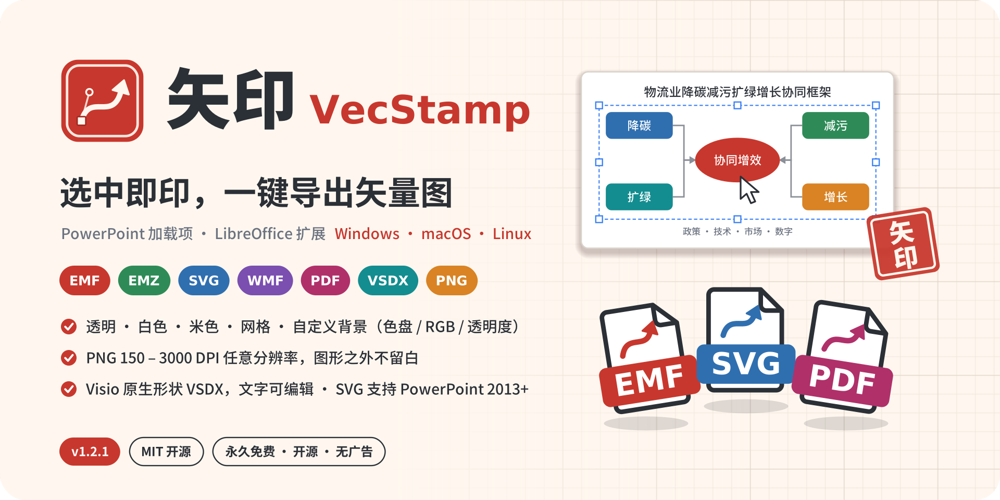
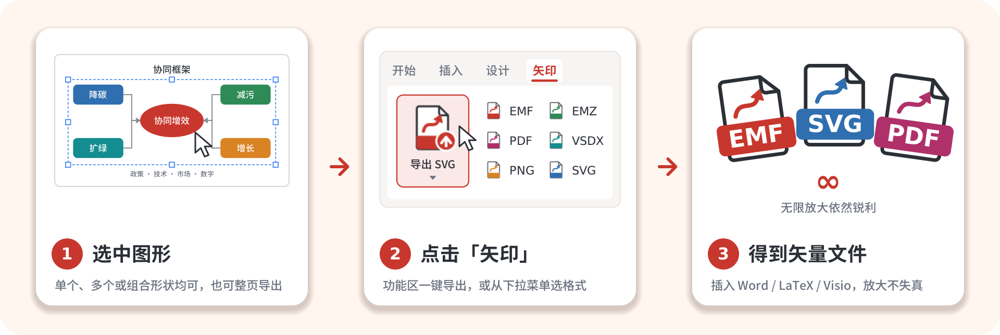
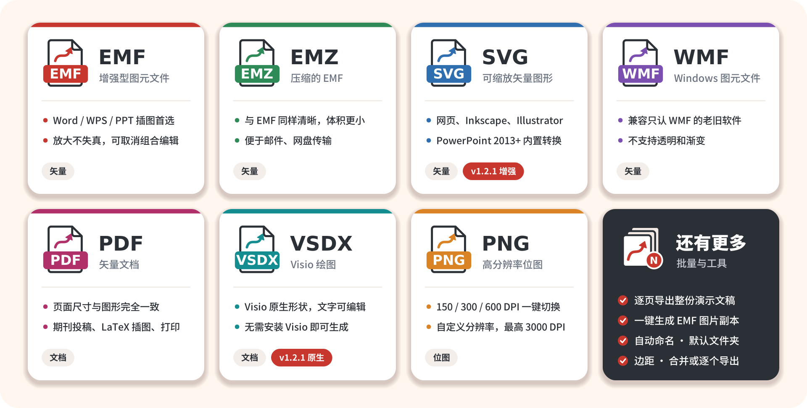
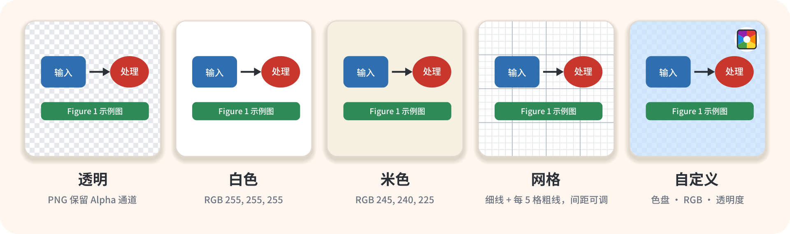
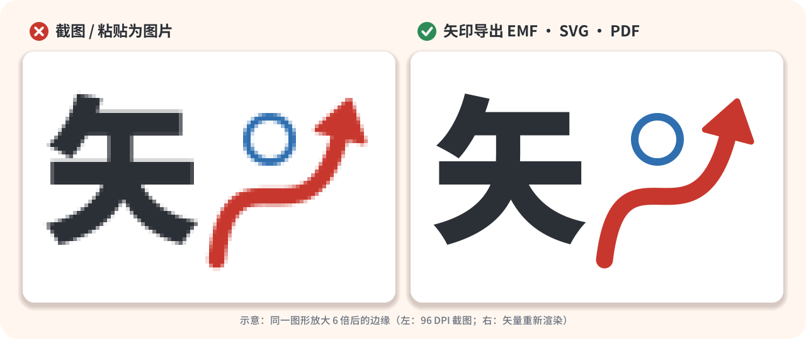
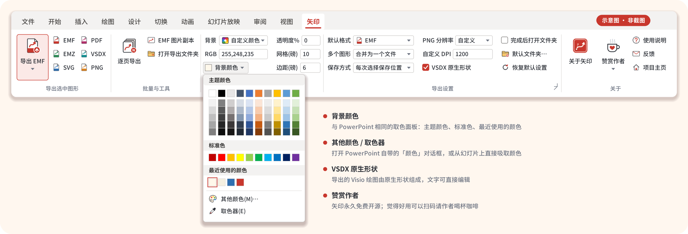
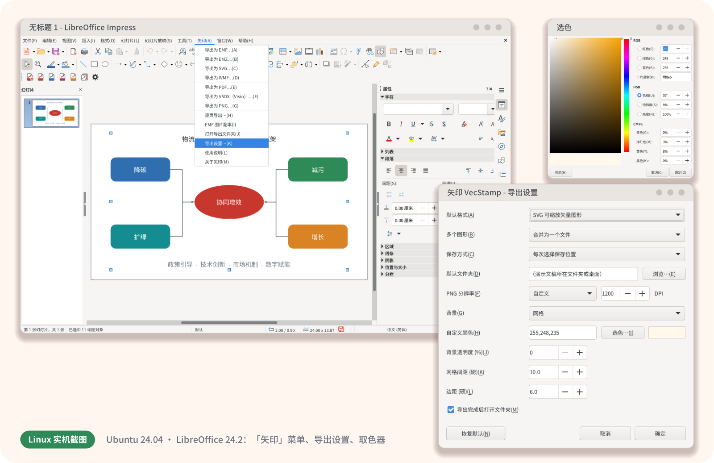
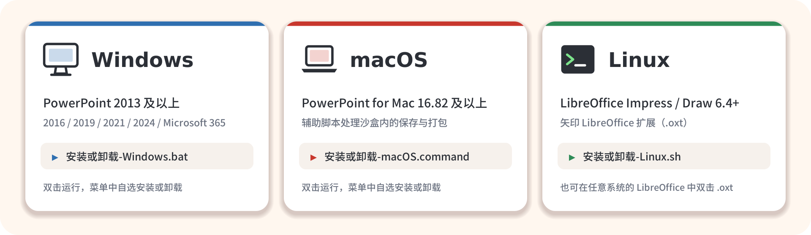

<p align="center">
  
</p>

<p align="center">
  
  
  
  
  
  
</p>

<p align="center">
  <b>在幻灯片里选中图形，点一下，得到能无限放大的矢量图。</b><br>
  为论文插图、标书配图、技术文档而做 —— PowerPoint 加载项（Windows / macOS）+ LibreOffice 扩展（Linux）。
</p>

<p align="center">
  <a href="#-v121-新功能">v1.2.1 新功能</a> ·
  <a href="#-七种格式按需而选">格式</a> ·
  <a href="#-背景与分辨率">背景与分辨率</a> ·
  <a href="#-安装">安装</a> ·
  <a href="#-常见问题">常见问题</a> ·
  <a href="#-赞赏支持">赞赏支持</a> ·
  <a href="docs/DEVELOPMENT.md">开发文档</a>
</p>

---

## 💡 为什么是「矢印」

**矢**是矢量，也是箭头；**印**是一按即成，像盖章一样把图「印」出来。Logo 是一枚朱红印章，里面是一条带锚点和控制柄的贝塞尔曲线箭头。

在 PowerPoint 里画好的框架图、流程图，放进 Word 投稿时最怕变成一张模糊的截图；而 PowerPoint 自带的「另存为图片」一次只能处理一个对象，还要逐层点菜单。矢印把这件事变成**一个按钮**：

<p align="center"></p>

## 🆕 v1.2.1 新功能

| | 更新内容 |
| --- | --- |
| ⏳ **导出进度窗口** | 导出时弹出进度窗口，显示「准备图形 → 合成背景 → 导出」等当前步骤，不再像卡住一样没有反应；Windows 上按 **Esc** 可取消逐页导出等长任务 |
| 📐 **VSDX 原生形状** | 不再依赖 Visio：矩形、圆角矩形、椭圆、箭头、连接线、自由曲线和文本框直接写成 **Visio 原生形状**，填充、线条、箭头和文字格式尽量保持一致，**文字可编辑**；图表、图片等无法转换的对象保留为 EMF 矢量图片，[详见下文](#-vsdxvisio-原生形状) |
| 🎨 **PowerPoint 同款取色** | 背景颜色改用与 PowerPoint 一样的面板：**主题颜色**（含深浅变化）、**标准色**、**最近使用的颜色**、**其他颜色…** 和 **取色器** |
| 🧩 **SVG 支持 PowerPoint 2013+** | 没有原生 SVG 导出的 PowerPoint 2013 – 2021 改用内置的 XPS → SVG 转换：保留路径、渐变、图片和可选中的文字，嵌入所用字体，无需安装其他软件，[详见下文](#-svg从-powerpoint-2013-起都能导出) |
| ✉️ **反馈** | 「反馈」按钮改为选择窗口：**发送邮件**（自动复制作者邮箱，可选打开邮件程序）或 **在 GitHub 提交 Issue**（自动填好版本和环境信息）；修复点击后只打开空白浏览器页面的问题 |
| ☕ **关于与赞赏** | 「关于」页面写明矢印**永久开源免费**，新增「赞赏作者」二维码和「项目主页」按钮 |
| 🌐 **宣传网站** | 新增可自行部署的静态宣传网站 `website/`，含放大对比演示和背景预览，[部署说明](website/README.md) |

v1.2.0 新增了 PDF / VSDX 导出、PNG 自定义分辨率（最高 3000 DPI）、米色 / 网格 / 自定义背景和 Linux 支持。完整记录见 [CHANGELOG.md](CHANGELOG.md)。

## 🧾 七种格式，按需而选

<p align="center"></p>

| 你要把图用在… | 推荐格式 | 说明 |
| --- | --- | --- |
| Word / WPS 论文、报告 | **EMF** | 插入后保持矢量，双击可取消组合再编辑 |
| 邮件、网盘发送 | **EMZ** | gzip 压缩的 EMF，内容相同、体积更小，Office 可直接插入 |
| 网页、Inkscape、Illustrator、Figma | **SVG** | 通用矢量格式，浏览器可直接打开；PowerPoint 2013 起均可导出 |
| 期刊投稿、LaTeX、打印 | **PDF** | 页面大小 = 图形大小，不留白边（PowerPoint 页面限制为 1 – 56 英寸，超出时等比缩放） |
| 交给 Visio 继续编辑 | **VSDX** | 由 Visio 原生形状组成，文字可编辑；不需要安装 Visio |
| 只接受位图的投稿系统 | **PNG** | 线条图建议 600 DPI 以上；支持透明背景 |
| 只认旧格式的老软件 | **WMF** | 不支持透明和渐变，非必要不选 |

## 🎨 背景与分辨率

<p align="center"></p>

- **透明**：默认值。PNG 保留 Alpha 通道，矢量格式不加任何底色。
- **白色 / 米色**：米色为 RGB 245, 240, 225，适合做出「纸张感」的插图。
- **网格**：白底上的方格纸，细线 RGB 222, 226, 232，每 5 格一条粗线 RGB 176, 184, 196；**网格间距**以磅为单位可调（2 – 200）。
- **自定义颜色**：点「背景颜色」打开与 PowerPoint 相同的取色面板（主题颜色、标准色、最近使用的颜色），或用「其他颜色…」「取色器」；也可以直接输入 `255,248,235`、`#FFF8EB`、`rgb(255,248,235)`；**透明度** 0 – 100 % 可调。
- **边距**：图形四周留白（磅），与任何背景都能组合。
- **PNG 分辨率**：150 / 300 / 600 DPI 一键切换，或选「自定义」输入 1 – 3000 DPI。超过约 1.2 亿像素时会先提醒你确认，避免生成过大的文件。

背景作用于全部七种格式：矢量格式中的背景本身也是矢量矩形和线条。

## 🔍 为什么一定要矢量

<p align="center"></p>

截图在放大、打印或被期刊重新排版时会出现锯齿和模糊；矢量图记录的是线条和文字本身，任何尺寸都能重新渲染得一样清晰，文件往往还更小。

## 🎛️ 功能区一览（PowerPoint）

<p align="center"></p>
<p align="center"><sub>示意图，按 <code>src/customUI14.xml</code> 中的实际布局绘制；不同 Office 版本的外观略有差异。</sub></p>

| 分组 | 控件 |
| --- | --- |
| 导出选中图形 | **导出 EMF**（大按钮，名称随默认格式变化；下拉菜单分「矢量图 / 文档 / 位图」列出全部格式）· EMF · EMZ · SVG · PDF · VSDX · PNG |
| 批量与工具 | **逐页导出**（每页一个文件，可只导出多选的页面）· EMF 图片副本 · 打开导出文件夹 |
| 背景 | 背景（透明 / 白色 / 米色 / 网格 / 自定义颜色）· RGB · **背景颜色**（主题颜色 / 标准色 / 最近使用的颜色 / 其他颜色… / 取色器）· 透明度% · 网格(磅) · 边距(磅) |
| 导出设置 | 默认格式 · 多个图形（合并 / 逐个）· 保存方式（每次询问 / 自动保存）· PNG 分辨率 · 自定义 DPI · VSDX 原生形状 · 完成后打开文件夹 · 默认文件夹 · 恢复默认设置 · 右下角查看当前全部设置 |
| 关于 | **关于矢印**（版本、作者、MIT 协议、永久免费声明）· **赞赏作者**（支付宝 / 微信二维码）· 使用说明 · 反馈（邮件 / GitHub Issue）· 项目主页 |

## 🐧 Linux：LibreOffice 扩展

Microsoft PowerPoint 没有 Linux 版，所以矢印在 Linux 上以 **LibreOffice Impress / Draw 扩展**的形式提供，功能与 PowerPoint 版一致：七种格式、五种背景、自定义 DPI、逐页导出、EMF 图片副本、Visio 原生形状。

<p align="center"></p>

安装后菜单栏多出 **矢印** 菜单和一条 **矢印** 工具栏；「导出设置…」对话框中可以设置全部选项，「选色…」打开 LibreOffice 自带的取色器（RGB / HSB / CMYK / 十六进制）；导出时状态栏显示进度；「关于」对话框中有赞赏二维码，「反馈」可选择邮件或 GitHub Issue。设置保存在 `~/.config/VecStamp/libreoffice-settings.json`。

> 这个 `.oxt` 扩展不依赖操作系统：Windows 和 macOS 上的 LibreOffice 用户也可以直接双击 `dist/VecStamp-LibreOffice.oxt` 安装。

## 🖥️ 支持的平台

<p align="center"></p>

| | Windows | macOS（实验性） | Linux |
| --- | --- | --- | --- |
| 宿主软件 | PowerPoint 2013 及以上（2016 / 2019 / 2021 / 2024 / Microsoft 365 / LTSC） | PowerPoint for Mac **16.82** 及以上 | LibreOffice **6.4** 及以上（Impress / Draw），需要 Python 支持 |
| EMF / EMZ / WMF / PNG / PDF | ✅ | ✅（以 PowerPoint for Mac 支持的格式为准） | ✅ |
| SVG | ✅ 版本 2302+ 原生导出；**2013 – 2021 使用内置 XPS 转换**，失败时再尝试 Inkscape / LibreOffice | ✅ 原生导出，备用 Inkscape / LibreOffice | ✅ |
| VSDX | ✅ Visio 原生形状（无需 Visio） | ✅ Visio 原生形状（实验性） | ✅ Visio 原生形状 |
| 进度窗口 | ✅ 可按 Esc 取消 | ✅ 「请稍候」提示 | ✅ 状态栏进度 |
| 背景颜色面板 | ✅ | ⚠️ 色块图片可能不显示，可用「其他颜色…」或 RGB 输入 | ✅ LibreOffice 取色器 |
| 安装器 | `安装或卸载-Windows.bat` | `安装或卸载-macOS.command` | `安装或卸载-Linux.sh` |

不支持 WPS 演示。

## 📦 安装

> 先下载并**完整解压**整个项目（不要在压缩软件里直接运行安装器）。所有安装器都只修改**当前用户**的设置，菜单中可以自选「安装 / 更新」或「卸载」。

### Windows

1. 保存并关闭所有 PowerPoint 窗口。
2. 双击 **`安装或卸载-Windows.bat`**，输入 `1`（安装 / 更新）。
3. 打开 PowerPoint，在「视图」右侧找到 **矢印** 选项卡。

如果 `dist` 文件夹里还没有 `VecStamp.ppam`，安装器会用你电脑上的 PowerPoint 从源码生成它。这一步需要**临时**开启「信任对 VBA 工程对象模型的访问」—— 安装器会先询问，得到你的同意后才开启，生成完成后立即恢复原设置。

安装器做的事情：

- 把 `VecStamp.ppam` 复制到 `%APPDATA%\Microsoft\AddIns`；
- 在 `HKCU\Software\Microsoft\Office\<版本>\PowerPoint\AddIns\VecStamp` 登记为自动加载；
- 「受信任位置」**默认不添加**，只有你看到宏被禁用、并在菜单中选择 `3` 时才会添加；
- 菜单 `4` 只生成 `dist\VecStamp.ppam` 而不安装，可用于发布或拷给 Mac 使用。

### macOS

1. 准备好 `dist/VecStamp.ppam`：使用 Release 中的文件、Windows 上用菜单 `4` 生成的文件，或按 [开发文档](docs/DEVELOPMENT.md#生成加载项) 在 Mac 上生成。
2. 退出 PowerPoint，双击 **`安装或卸载-macOS.command`**，输入 `1`。
   首次运行如果提示「无法验证开发者」，请在访达中**右键 → 打开**，或在终端运行 `bash 安装或卸载-macOS.command`。
3. 按提示在 PowerPoint 中启用一次：「工具 → PowerPoint 加载项… → + → 选择 VecStamp.ppam → 确定」，询问时选择「启用宏」。

安装器把加载项放到 Office 加载项文件夹，并安装辅助脚本 `~/Library/Application Scripts/com.microsoft.Powerpoint/VecStamp.scpt`。PowerPoint for Mac 的 VBA 运行在沙盒中，保存对话框、写出文件、EMZ / VSDX 打包、取色器和 SVG 备用转换都通过这个脚本完成。安装器不会修改任何系统安全设置。

### Linux

```bash
bash 安装或卸载-Linux.sh          # 菜单：1 安装 / 更新，2 卸载
bash 安装或卸载-Linux.sh install  # 也可以直接带参数：install | uninstall | status
```

- 使用 `unopkg` 以**用户模式**安装，**不需要 sudo**（以 root 运行会被拒绝）。
- 自动查找系统版、`/opt` 官方版、Snap 版和 Flatpak 版 LibreOffice。
- 如果缺少 LibreOffice 的 Python 支持，会给出对应发行版的安装命令，例如 Debian / Ubuntu：`sudo apt install python3-uno libreoffice-script-provider-python`；Fedora：`sudo dnf install libreoffice-pyuno`。
- 也可以不用脚本：LibreOffice 菜单「工具 → 扩展管理器 → 添加」，选择 `dist/VecStamp-LibreOffice.oxt`。

## 🗑️ 卸载

- **Windows**：关闭 PowerPoint，运行 `安装或卸载-Windows.bat`，输入 `2`。删除加载项文件、注册表登记、安装器添加过的受信任位置，并可选删除导出设置。
- **macOS**：退出 PowerPoint，运行 `安装或卸载-macOS.command`，输入 `2`；之后在「工具 → PowerPoint 加载项…」中选中 VecStamp 点「−」。
- **Linux**：关闭 LibreOffice，运行 `安装或卸载-Linux.sh`，输入 `2`（或 `bash 安装或卸载-Linux.sh uninstall`），可选删除导出设置。

## 🧩 SVG：从 PowerPoint 2013 起都能导出

PowerPoint 只有 **Microsoft 365 / Office 2024 版本 2302 及以上**（Mac 16.82 及以上）才能原生导出 SVG；Office 2013 / 2016 / 2019 / 2021 / LTSC 调用同一接口时，可能写出别的 XML 内容而不报错 —— 这就是旧版本导出的 SVG 在浏览器中显示 *“This XML file does not appear to have any style information…”* 的原因。v1.2.1 按以下顺序处理：

1. **原生导出**：先让 PowerPoint 直接导出，再检查文件：根元素必须是 SVG 命名空间中的 `<svg>`，缺少的 `xmlns` / `xmlns:xlink` 自动补上。
2. **内置 XPS 转换**（Windows，v1.2.1 新增）：原生导出不可用时，矢印把图形单独放到一页临时幻灯片上（隐藏母版和背景），用 PowerPoint 自带的「导出为 XPS」打印成矢量页面，再由内置的 PowerShell 脚本 [`src/helpers/xps2svg.ps1`](src/helpers/xps2svg.ps1) 把 XPS 转成 SVG：
   - 路径、线条（线宽、虚线、端点、连接方式）、纯色 / 线性 / 径向渐变和图片填充、裁剪和透明度都保留为 SVG 元素；
   - 文字保留为可选中、可搜索的 `<text>`，并把 XPS 中经过混淆的字体子集还原后以 `@font-face` 嵌入，在没有该字体的电脑上也能正确显示；
   - 只裁出图形所在区域，不留整页白边。
   转换脚本内嵌在加载项中，用系统自带的 Windows PowerShell 在本机运行，不联网、不需要安装任何软件。
3. **Inkscape / LibreOffice**：以上都不行时，先导出 EMF，再用本机的 Inkscape 或 LibreOffice 转换。
4. 仍然失败时，询问你是否改为导出 EMF，而不是留下一个打不开的文件。

如果你遇到的 SVG 仍然有问题，欢迎把文件和 PowerPoint 版本号（「文件 → 账户 → 关于 PowerPoint」）发到 <vluckyzhang@gmail.com>。

## 📐 VSDX：Visio 原生形状

v1.2.1 起，矢印自己生成 Visio 2013+ 格式的 `.vsdx`，**不需要安装 Visio**，图形以原生形状写入：

| PowerPoint 中的对象 | 在 Visio 中 |
| --- | --- |
| 矩形、圆角矩形、椭圆、三角形、箭头、星形、流程图等常用形状 | 原生形状，几何按 OOXML 预设公式计算（包括调整控点） |
| 直线、肘形 / 曲线连接线 | 原生线条，保留线宽、虚线样式和两端箭头 |
| 自由曲线、任意多边形 | 原生形状，贝塞尔曲线写成 NURBS，保持平滑 |
| 文本框和形状中的文字 | 可直接编辑的文字，保留字体、字号、颜色、粗体 / 斜体 / 下划线、段落对齐和内边距 |
| 组合 | Visio 组合，层级不变 |
| 填充与线条 | 纯色、透明度、渐变（取近似）、线宽、线型；旋转和翻转 |
| 图表、SmartArt、图片、表格、艺术字特效等 | 无法对应的对象作为 **EMF 矢量图片**放在原位，仍可缩放 |

需要整张图作为一个整体时，在「导出设置」中取消勾选 **VSDX 原生形状**，即生成内嵌 EMF 矢量图的 VSDX。LibreOffice 扩展同样支持两种方式。

## ✨ 使用技巧

- **没有选中任何东西**时，矢印会询问是否导出当前幻灯片上的全部图形（自动跳过空占位符）。
- 合并导出、加背景或边距、导出 PDF 时，矢印会临时借用剪贴板，在演示文稿末尾插入一页临时幻灯片（或一个不可见的临时演示文稿），完成后自动删除，不会改变文件的「已保存」状态。
- 选中组合内部的个别图形时，只导出这些图形。
- 占位符（标题框等）无法被组合：合并导出时会自动改用 EMF 图片方式，仍然是矢量。
- 「多个图形」选「逐个」时，文件名取自「选择窗格」中的形状名称。
- 导出较大的图形或逐页导出时会显示进度窗口；Windows 上按 **Esc** 可以在两步之间取消。
- 背景颜色面板中最近选过的颜色会保留在「最近使用的颜色」里（最多 10 个）。
- 所有导出命令也是公开宏（`VS_ExportEMF`、`VS_ExportPDF`、`VS_ExportVSDX`、`VS_ExportSlides`、`VS_PickColor`、`VS_MoreColors`、`VS_Eyedropper`、`VS_Feedback` 等），可以添加到快速访问工具栏。

## ❓ 常见问题

<details>
<summary><b>PowerPoint 里看不到「矢印」选项卡 / 提示宏已被禁用</b></summary>

先确认「文件 → 选项 → 加载项 → 管理：PowerPoint 加载项 → 转到」中 VecStamp 已勾选。如果显示宏被禁用，重新运行 Windows 安装器并选择 `3`，把加载项所在文件夹添加为受信任位置（只影响这一个文件夹，可随时在卸载时移除）。
</details>

<details>
<summary><b>VSDX 在 Visio 中是一张图片，不能编辑？</b></summary>

确认「导出设置」中勾选了 **VSDX 原生形状**（默认勾选）。勾选后，常用形状、连接线、自由曲线和文字都是可编辑的 Visio 原生形状；只有图表、SmartArt、图片等没有 Visio 对应物的对象才会作为 EMF 矢量图片保留。某个形状转换结果和原图差别较大时，欢迎附上 PPT 文件反馈。
</details>

<details>
<summary><b>用 LibreOffice 打开导出的 VSDX，图片后面有一块浅蓝色？</b></summary>

这是 LibreOffice 读取 VSDX 中「外部对象（EMF 图片）」时的显示方式，与文件内容无关；在 Visio 中不会出现。
</details>

<details>
<summary><b>导出时显示「正在导出…」窗口，要等多久？</b></summary>

普通图形一两秒即可完成；含大量形状的组合、逐页导出整份演示文稿、PNG 高分辨率以及旧版 PowerPoint 的 SVG（需要先打印成 XPS 再转换）会慢一些，进度窗口会显示当前步骤。Windows 上按 Esc 可以取消。
</details>

<details>
<summary><b>点「反馈」后怎么发送？</b></summary>

在弹出的窗口中选「是」发送邮件：作者邮箱会复制到剪贴板，你可以用任何网页邮箱发送，也可以选择打开电脑上的默认邮件程序；选「否」会在浏览器中打开 GitHub 的新建 Issue 页面，版本和系统信息已经填好（需要 GitHub 账号，内容公开）。
</details>

<details>
<summary><b>导出的 EMF 在别人电脑上字体变了</b></summary>

EMF / SVG 保存的是字体名称，对方电脑缺少该字体时会被替换。需要固定字体时请导出 **PDF**（字体随文件嵌入），或在投稿前用 Inkscape / Illustrator 把文字转为曲线。
</details>

<details>
<summary><b>3000 DPI 的 PNG 为什么提示文件过大？</b></summary>

像素数随 DPI 的平方增长：一张 10 × 6 英寸的图在 3000 DPI 下有 5.4 亿像素。超过约 1.2 亿像素时矢印会先提醒你确认；论文插图通常 600 – 1200 DPI 就足够了，需要更高清晰度时优先考虑矢量格式。
</details>

<details>
<summary><b>Linux 安装时提示没有 Python 支持</b></summary>

部分发行版把 LibreOffice 的 Python 支持拆成了单独的包：Debian / Ubuntu / Deepin / UOS 安装 `python3-uno` 和 `libreoffice-script-provider-python`，Fedora / openEuler 安装 `libreoffice-pyuno`，openSUSE 安装 `libreoffice-pyuno`。Arch 和 LibreOffice 官方 `.deb/.rpm`、Flatpak、Snap 版本已自带。
</details>

## 🧪 测试状态

坦白说明当前的验证范围，欢迎在其他环境中试用并反馈：

| 部分 | 验证方式 |
| --- | --- |
| LibreOffice 扩展（Linux） | Ubuntu 24.04 + LibreOffice 24.2 实测：7 种格式 × 5 种背景逐一导出并校验文件，VSDX 原生形状导出后重新导入比对，逐页导出、EMF 图片副本、设置 / 关于 / 反馈对话框、`unopkg` 安装 / 卸载均通过；自动化测试见 `tests/test_libreoffice.py` |
| Linux 安装器 | 普通用户下安装、更新、状态查询、卸载及拒绝 root 均实测通过 |
| PowerPoint 加载项（VBA） | 通过 VBA 语法解析、三种条件编译路径的静态检查和功能区 XML Schema 校验；VSDX 预设形状公式用 Python 移植版与 LibreOffice 渲染逐一比对；XPS → SVG 转换脚本用含混淆字体、渐变和图片的 XPS 样例在 PowerShell 7 下验证。**尚未在真实的 PowerPoint / Visio / Mac 上运行 v1.2.1**（进度窗口、取色面板、XPS 打印等），如遇问题请反馈 |
| Windows / macOS 安装器 | PowerShell 语法解析、shellcheck 检查通过 |
| 宣传网站 | Chromium 中桌面 / 手机宽度、浅色 / 深色模式截图检查，放大对比与背景预览交互自动化测试 |

## 🧱 从源码构建

```bash
pip install cairosvg python-pptx pillow
python build/build.py            # 图标 → VBA 模块 → 静态检查 → 功能区检查 → 模板 → LibreOffice 扩展
python build/build.py --promo    # 另外重新生成 README 配图和宣传网站图片
python3 tests/test_libreoffice.py   # LibreOffice 扩展端到端测试（Linux，普通用户运行）
python3 tests/test_xps2svg.py      # XPS → SVG 转换脚本测试（需要 PowerShell 7 / Windows PowerShell）
```

`VecStamp.ppam` 需要由 PowerPoint 生成（Windows 安装器菜单 `4`，或手动导入模块后另存为加载项）。项目结构、构建流程、开发约定和发布清单见 **[docs/DEVELOPMENT.md](docs/DEVELOPMENT.md)**。

## 🌐 宣传网站

[`website/`](website/) 是一个可以直接部署的静态宣传网站（单个 `index.html`，不依赖任何 CDN 或外部字体，国内服务器也能快速打开）：首屏的「截图 vs 矢量」放大对比演示、可交互的背景预览、安装说明、常见问题和赞赏二维码，自动适配手机和深色模式。修改 `website/config.js` 中的下载地址和备案号后上传到任意 Web 服务器即可，Nginx / 宝塔 / Caddy / 对象存储的部署步骤见 [website/README.md](website/README.md)。

## ☕ 赞赏支持

**矢印永久开源、永久免费**：以 MIT 协议发布，没有广告，不联网、不收集任何数据，也不会推出收费版本，所有功能对每个人开放。

如果它帮你省下了时间，欢迎扫码请作者喝杯咖啡 ☕ —— 赞赏完全自愿，不影响任何功能。在 GitHub 点个 ⭐、提交建议，或者把矢印分享给需要的同学同事，同样是很大的支持。

<p align="center">
  
  &nbsp;&nbsp;&nbsp;&nbsp;
  
</p>
<p align="center"><sub>左：支付宝 &nbsp;·&nbsp; 右：微信支付。加载项「矢印」选项卡中的「赞赏作者」和「关于矢印」里也有这两个二维码。</sub></p>

## 📜 许可证与作者

本项目以 [MIT License](LICENSE) 开源，可自由使用、修改和分发。

Copyright (c) 2026 **vluckyzhang** · <vluckyzhang@gmail.com>

欢迎通过邮件、加载项中的「反馈」按钮（可选邮件或 GitHub Issue）或 [Issue](https://github.com/vluckyzhang/VecStamp/issues) 提出问题和建议。如果矢印帮你省下了一点时间，给项目点个 ⭐ 吧！

<sub>第三方说明：VSDX 模板中「No Style」样式的默认值参考了 BSD 协议的 vsdx 软件包所附的空白绘图，详见 [THIRD_PARTY_NOTICES.md](THIRD_PARTY_NOTICES.md)。Microsoft、PowerPoint、Visio、Windows 是 Microsoft Corporation 的商标；macOS 是 Apple Inc. 的商标；LibreOffice 是 The Document Foundation 的商标；支付宝、微信是其各自所有者的商标；本项目与上述公司无隶属关系。</sub>
